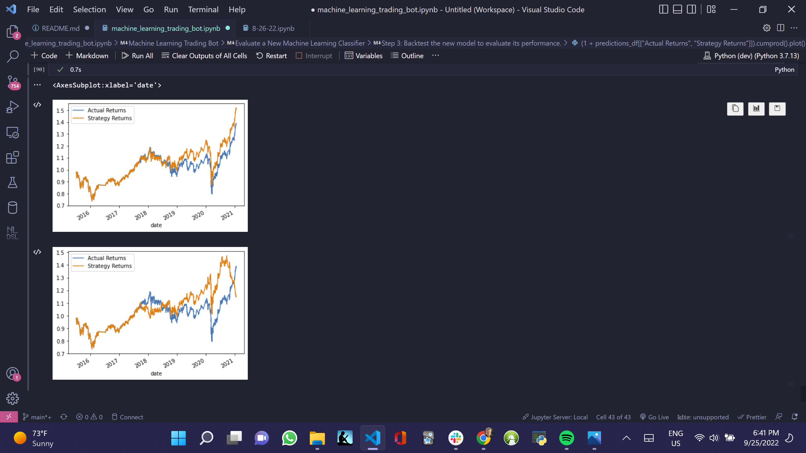

# Module_14_Challenge

## Introduction and Conclusions

In this Challenge, I will assume the role of a financial advisor at one of the top five financial advisory firms in the world. The firm has heavily profited by using computer algorithms that can buy and sell faster than human traders.

The speed of these transactions gave your firm a competitive advantage early on. But, people still need to specifically program these systems, which limits their ability to adapt to new data. We are, thus, planning to improve the existing algorithmic trading systems and maintain the firm’s competitive advantage in the market. To do so, I’ll enhance the existing trading signals with machine learning algorithms that can adapt to new data.

In order to this I will establish a baseline performance. Then, I will adjust the baseline trading algorithm or machine (SVM) learning method to fit the training data and make predictions based on the testing data. I will then create a classification report associated with the `SVC` model predictions.

My evaluation report is that, as you can see from the image below, the strategy in the first image tends to follow the actual returns more closely, particulary in the 2021 period, which inverts the returns, which is not good for a model, and, therefore, I choose the first model.

##  </br>

# Technologies

This was developed with Anaconda, in a development environment running Python 3.7.13. If the following libraries do not run, then install them with pip install.

# Imports

import pandas as pd
import numpy as np
from pathlib import Path
import hvplot.pandas
import matplotlib.pyplot as plt
from sklearn import svm
from sklearn.preprocessing import StandardScaler
from pandas.tseries.offsets import DateOffset
from sklearn.metrics import classification_report

---

git clone https://github.com/JeffSmith-ok/Module_14_Challenge

cd Module_14_Challenge

In the terminal type 'Jupyter Lab'

---

This is the Module 14 Challenge.

My contact information is:

Name: Jeffrey M. Smith </br>
Linkedin: https://www.linkedin.com/in/jeffsmith77/ </br>
Personal email: jsmith@lexsmith.finance</br>

---

## License

MIT License

Copyright (c) 2022 Jeffrey M. Smith

Permission is hereby granted, free of charge, to any person obtaining a copy of this software and associated documentation files (the "Software"), to deal in the Software without restriction, including without limitation the rights to use, copy, modify, merge, publish, distribute, sublicense, and/or sell
copies of the Software, and to permit persons to whom the Software is furnished to do so, subject to the following conditions:

The above copyright notice and this permission notice shall be included in all copies or substantial portions of the Software.

THE SOFTWARE IS PROVIDED "AS IS", WITHOUT WARRANTY OF ANY KIND, EXPRESS OR IMPLIED, INCLUDING BUT NOT LIMITED TO THE WARRANTIES OF MERCHANTABILITY, FITNESS FOR A PARTICULAR PURPOSE AND NONINFRINGEMENT. IN NO EVENT SHALL THE AUTHORS OR COPYRIGHT HOLDERS BE LIABLE FOR ANY CLAIM, DAMAGES OR OTHER LIABILITY, WHETHER IN AN ACTION OF CONTRACT, TORT OR OTHERWISE, ARISING FROM, OUT OF OR IN CONNECTION WITH THE SOFTWARE OR THE USE OR OTHER DEALINGS IN THE
SOFTWARE.

```

```
